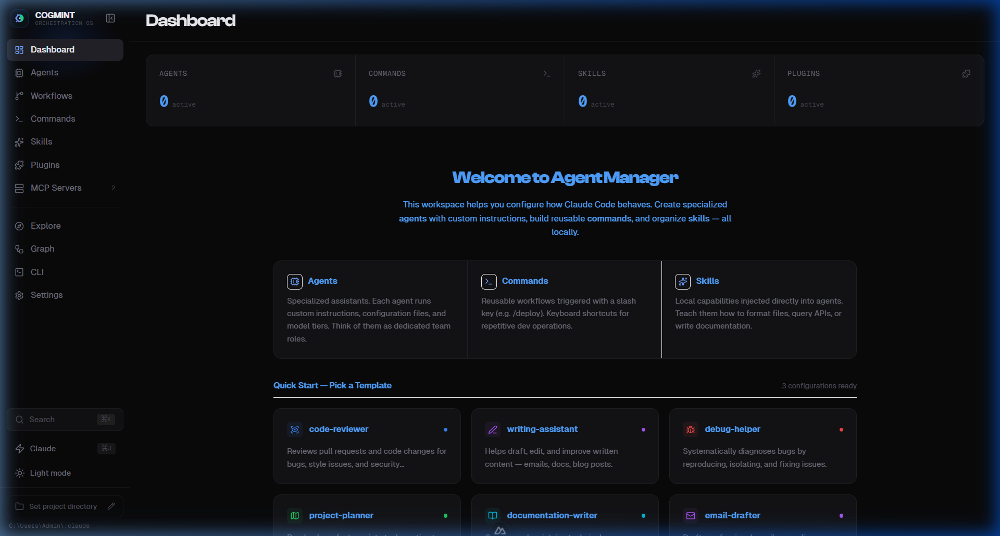
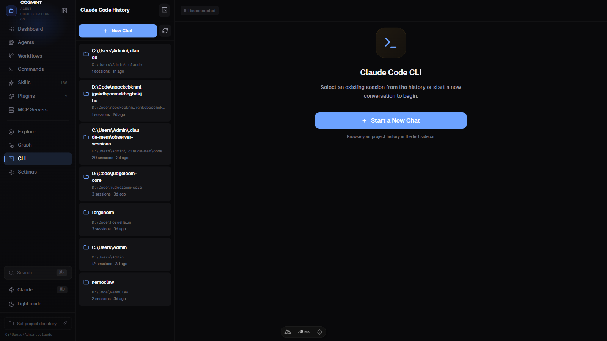
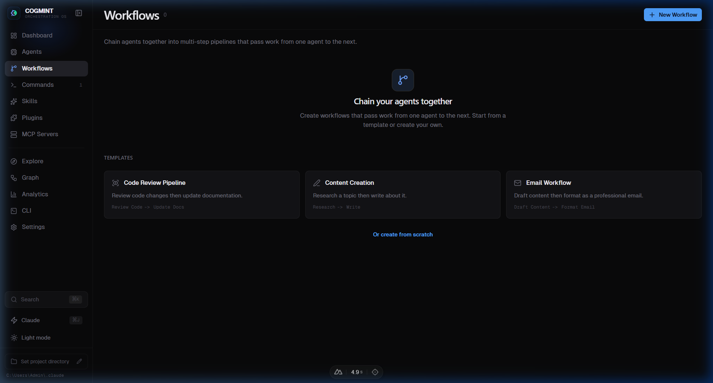
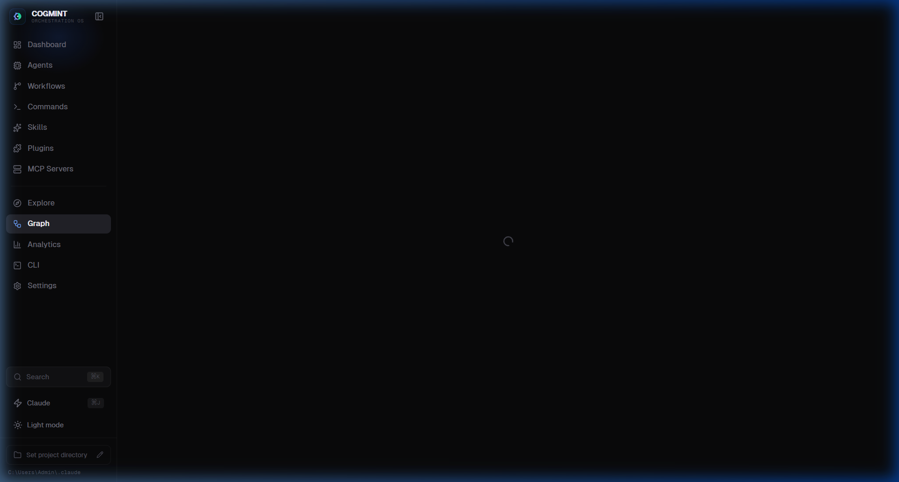

<div align="center">

# COGMINT

<p>
  <strong>Dark-first control plane for Claude Code orchestration.</strong>
</p>

<p>
  <a href="https://nuxt.com/"></a>
  <a href="https://vuejs.org/"></a>
  <a href="https://bun.sh/"></a>
  <a href="./LICENSE"></a>
  
  
</p>

<p>
  <a href="#quick-start">Quick Start</a> ·
  <a href="#features">Features</a> ·
  <a href="#ui-preview">UI Preview</a> ·
  <a href="#roadmap">Roadmap</a> ·
  <a href="./CONTRIBUTING.md">Contributing</a>
</p>


</div>

---

## Why COGMINT

COGMINT turns Claude Code management from a config-file maze into a visual operating surface.

- Build and manage **multi-agent systems** faster
- Control **skills, commands, workflows, and plugins** from one UI
- Track **sessions and execution context** with less friction
- Keep customization local to your own `.claude` workspace

---

## Quick Start

```bash
git clone https://github.com/ThanhNguyxn07/cogmint.git
cd cogmint
bun install
bun run dev
```

Open `http://localhost:3000`.

> Requirements: Bun (recommended) or Node.js 18+.

---

## Features

### 1) Agent Orchestration Workspace

Design, organize, and edit agents visually instead of hand-editing markdown everywhere.

- Agent metadata + model setup
- Prompt/instruction editing
- Memory and behavior controls




---

### 2) Chat + Studio Testing Loop

Test behavior quickly with a live interface.

- Real-time iteration
- Tool/event visibility
- Faster debugging cycle




---

### 3) Workflow and Relationship Mapping

Understand and operate your system topology.

- Workflow builder for multi-step execution
- Relationship graph for connected entities




---

### 4) Skill and Plugin Operations

Scale your local ecosystem with better control.

- Skill import and management
- Plugin visibility and toggles
- Better discoverability via Explore


---

## UI Preview

COGMINT uses a **dark-first cobalt/violet design system** for long sessions and reduced eye strain.

Brand assets included in `public/`:

- `favicon.svg`, `favicon.ico`
- `favicon-16x16.png`, `favicon-32x32.png`
- `apple-touch-icon.png`
- `icon-192.png`, `icon-512.png`
- `site.webmanifest`

---

## i18n (English-first)

Current baseline:

- English default (`en`)
- Locale field persisted in settings (`settings.locale`)
- Vietnamese scaffold included for progressive rollout

Language selector is available in **Settings**.

---

## Tech Stack

- Nuxt 3 + Vue 3
- Nuxt UI + Tailwind CSS
- VueFlow
- Bun runtime
- TypeScript

---

## Environment Variables

| Variable | Description | Default |
|---|---|---|
| `CLAUDE_DIR` | Path to your Claude config directory | `~/.claude` |
| `CLAUDE_CLI_PATH` | Optional explicit path to Claude CLI executable | Auto-detected |

---

## Roadmap

- [ ] Full i18n coverage across all pages
- [ ] GIF demo walkthroughs for README
- [ ] Theme presets and workspace personalization packs
- [ ] Extended test harness for workflow simulation

---

## Contributing

See [CONTRIBUTING.md](./CONTRIBUTING.md).

---

## License

MIT — see [LICENSE](./LICENSE).
